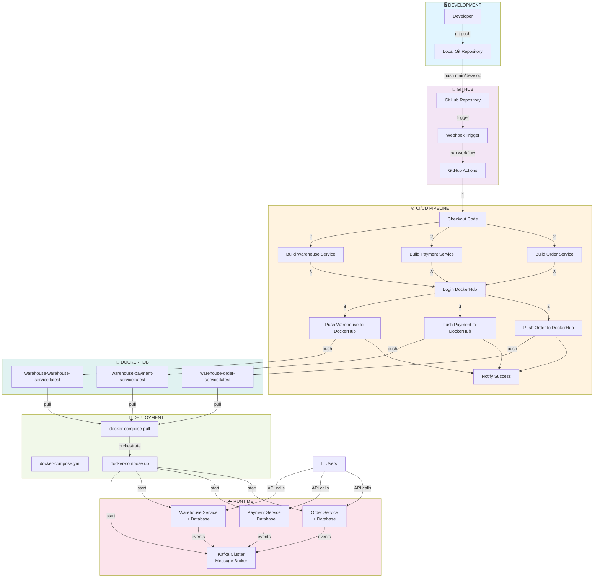

# Warehouse Application - Schema Architetturale di Deployment

## 🎯 Flusso di Deployment Completo



## 📋 Struttura dei Container

```
┌─────────────────────────────────────────────────────────────────┐
│                     Docker Compose Network                       │
├─────────────────────────────────────────────────────────────────┤
│                                                                   │
│  ORDER SERVICE STACK                                             │
│  ┌──────────────────────────────────────────────────────────┐   │
│  │ Container: order-service                                 │   │
│  │ Port: 5001:8080                                          │   │
│  │ Image: your-user/warehouse-order-service:latest          │   │
│  │ ├─ Order.Business                                        │   │
│  │ ├─ Order.Repository                                      │   │
│  │ ├─ Order.ClientHttp                                      │   │
│  │ └─ Order.WebApi (Entry Point)                            │   │
│  └──────────────────────────────────────────────────────────┘   │
│  ┌──────────────────────────────────────────────────────────┐   │
│  │ Container: order-postgres                                │   │
│  │ Port: 5431:5432                                          │   │
│  │ Database: order_db                                       │   │
│  └──────────────────────────────────────────────────────────┘   │
│                                                                   │
│  PAYMENT SERVICE STACK                                           │
│  ┌──────────────────────────────────────────────────────────┐   │
│  │ Container: payment-service                               │   │
│  │ Port: 5003:8080                                          │   │
│  │ Image: your-user/warehouse-payment-service:latest        │   │
│  └──────────────────────────────────────────────────────────┘   │
│  ┌──────────────────────────────────────────────────────────┐   │
│  │ Container: payment-postgres                              │   │
│  │ Port: 5433:5432                                          │   │
│  │ Database: payment_db                                     │   │
│  └──────────────────────────────────────────────────────────┘   │
│                                                                   │
│  WAREHOUSE SERVICE STACK                                         │
│  ┌──────────────────────────────────────────────────────────┐   │
│  │ Container: warehouse-service                             │   │
│  │ Port: 5002:8080                                          │   │
│  │ Image: your-user/warehouse-warehouse-service:latest      │   │
│  └──────────────────────────────────────────────────────────┘   │
│  ┌──────────────────────────────────────────────────────────┐   │
│  │ Container: warehouse-postgres                            │   │
│  │ Port: 5432:5432                                          │   │
│  │ Database: warehouse_db                                   │   │
│  └──────────────────────────────────────────────────────────┘   │
│                                                                   │
│  MESSAGE BROKER                                                  │
│  ┌──────────────────────────────────────────────────────────┐   │
│  │ Container: ecommerce-kafka                               │   │
│  │ Port: 9092:9092 (External), 29092 (Internal)             │   │
│  │ Image: confluentinc/cp-kafka:7.4.0                       │   │
│  │ Mode: KRaft (Kubernetes Raft)                            │   │
│  └──────────────────────────────────────────────────────────┘   │
│                                                                   │
│  PERSISTENT VOLUMES                                              │
│  • order_db_data       → /var/lib/postgresql/data                │
│  • payment_db_data     → /var/lib/postgresql/data                │
│  • warehouse_db_data   → /var/lib/postgresql/data                │
│                                                                   │
└─────────────────────────────────────────────────────────────────┘
```

## 🔄 Flusso Dettagliato GitHub Actions

### Trigger Event
```
Git Push to main/develop
        ↓
GitHub detects changes in:
  - OrderService/**
  - PaymentService/**
  - WarehouseService/**
  - docker-compose.yml
  - .github/workflows/deploy.yml
        ↓
Webhook → GitHub Actions
```

### Job Paralleli (Per ogni servizio)

```
┌─ Build Order Service ─────────────┐
│ 1. Checkout code                  │
│ 2. Setup Docker Buildx            │
│ 3. Login to DockerHub             │
│ 4. Extract metadata               │
│ 5. Build multi-stage Dockerfile   │
│    └─ Stage 1: Base               │
│    └─ Stage 2: SDK + Build        │
│    └─ Stage 3: Publish            │
│    └─ Stage 4: Runtime            │
│ 6. Push to DockerHub              │
│ 7. Generate output tags           │
└───────────────────────────────────┘
         ↓
    Same for Payment & Warehouse
         ↓
    Parallel Execution (3x faster!)
         ↓
┌─ Notify Success ──────────────────┐
│ Display all image tags pushed     │
└───────────────────────────────────┘
```

## 📦 Multi-Stage Docker Build

Ogni Dockerfile segue questo pattern:

```dockerfile
# Stage 1: Base Runtime
FROM mcr.microsoft.com/dotnet/aspnet:8.0-alpine AS base
  └─ Lightweight, only runtime dependencies

# Stage 2: SDK + Build
FROM mcr.microsoft.com/dotnet/sdk:8.0-alpine AS build
  └─ Compila il progetto .NET
  └─ Resolve NuGet dependencies

# Stage 3: Publish
FROM build AS publish
  └─ Pubblica l'applicazione
  └─ Ottimizzazione Release

# Stage 4: Final Runtime
FROM base AS final
  └─ Copia solo i binari pubblicati
  └─ Immagine finale (~150MB)
```

## 🗂️ File di Configurazione

```
WarehouseApplication/
├── .github/workflows/
│   └── deploy.yml                    ← GitHub Actions Workflow
├── OrderService/
│   ├── Dockerfile                    ← Build Order Service
│   ├── OrderService.WebApi.csproj
│   └── [projects structure]
├── PaymentService/
│   ├── Dockerfile                    ← Build Payment Service
│   └── [projects structure]
├── WarehouseService/
│   ├── Dockerfile                    ← Build Warehouse Service
│   └── [projects structure]
├── docker-compose.yml                ← Orchestrazione locale
├── nuget.config                      ← NuGet private packages
├── .env.example                      ← Template variabili di ambiente
└── DEPLOYMENT.md                     ← Guida deployment
```

## 🔐 Secrets Management Flow

```
GitHub Secrets Store
  ├─ DOCKERHUB_USERNAME
  ├─ DOCKERHUB_TOKEN
  └─ GITHUB_TOKEN
         ↓
   GitHub Actions Workflow
         ↓
   Used in build context (build-args)
         ↓
   Docker Build (Multi-stage)
         ↓
   DockerHub Push
```

## 🚀 Deployment Flow

```
1. LOCAL DEVELOPMENT
   ├─ Developer commits code
   ├─ git push origin main
   └─ Local `.env` per testing

2. GITHUB DETECTION
   ├─ Webhook triggered
   ├─ Event: push to main/develop
   └─ Files changed detected

3. CI/CD PIPELINE
   ├─ Checkout repository
   ├─ Setup Docker build environment
   ├─ Build 3 services in parallel
   │  ├─ Order Service
   │  ├─ Payment Service
   │  └─ Warehouse Service
   └─ Push to DockerHub

4. DOCKERHUB REGISTRY
   ├─ warehouse-order-service:latest
   ├─ warehouse-payment-service:latest
   └─ warehouse-warehouse-service:latest

5. DOCKER COMPOSE DEPLOYMENT
   ├─ Pull latest images
   ├─ Start containers in order
   │  ├─ Databases first (dependencies)
   │  ├─ Kafka broker
   │  └─ Microservices
   └─ Network services together

6. RUNNING SYSTEM
   ├─ 3 Microservices (online)
   ├─ 3 PostgreSQL databases
   ├─ 1 Kafka message broker
   └─ Event-driven communication
```

## 📊 Environment Variables Flow

```
.env (Local Development)
  ↓ Source of truth
  ├─ DOCKERHUB_USERNAME
  ├─ DOCKERHUB_TOKEN
  ├─ GITHUB_TOKEN
  └─ SERVICE_TAGS
  
GitHub Secrets (Production)
  ↓ Secure storage
  ├─ DOCKERHUB_USERNAME
  ├─ DOCKERHUB_TOKEN
  └─ GITHUB_TOKEN
  
GitHub Actions Workflow
  ↓ Injected at runtime
  ├─ Decrypt secrets
  ├─ Validate tokens
  ├─ Pass to Docker build
  └─ Push to registry

docker-compose.yml
  ↓ Runtime configuration
  ├─ Read from .env
  ├─ Override with docker-compose environment
  ├─ Set container env vars
  └─ Services use during execution
```

## 🔗 Servizi Interconnessi

```
Order Service (5001)
  ├─ Order.WebApi        (HTTP REST)
  ├─ Order.Business      (Logic)
  ├─ Order.Repository    (DB Access)
  ├─ Order.Shared        (DTOs)
  ├─ Order.ClientHttp    (External calls)
  └─ Database: PostgreSQL
       └─ Publishes: OrderCreated, OrderUpdated

         ↓ (Kafka Events)

Payment Service (5003)
  ├─ Payment.WebApi
  ├─ Payment.Business
  ├─ Payment.Repository
  ├─ Payment.Shared
  ├─ Payment.ClientHttp
  └─ Database: PostgreSQL
       └─ Listens: OrderCreated
       └─ Publishes: PaymentProcessed

         ↓ (Kafka Events)

Warehouse Service (5002)
  ├─ Warehouse.WebApi
  ├─ Warehouse.Business
  ├─ Warehouse.Repository
  ├─ Warehouse.Shared
  ├─ Warehouse.ClientHttp
  └─ Database: PostgreSQL
       └─ Listens: OrderCreated, PaymentProcessed
       └─ Publishes: StockReserved
```

---

**Note per l'implementazione:**
- Tutti i Dockerfile usano alpine linux (~5MB base)
- Multi-stage build riduce la dimensione finale ~40%
- Parallel build in GitHub Actions riduce tempo di ~60%
- Event-driven architecture via Kafka per loose coupling
- Database separation assicura independence per scalabilità
